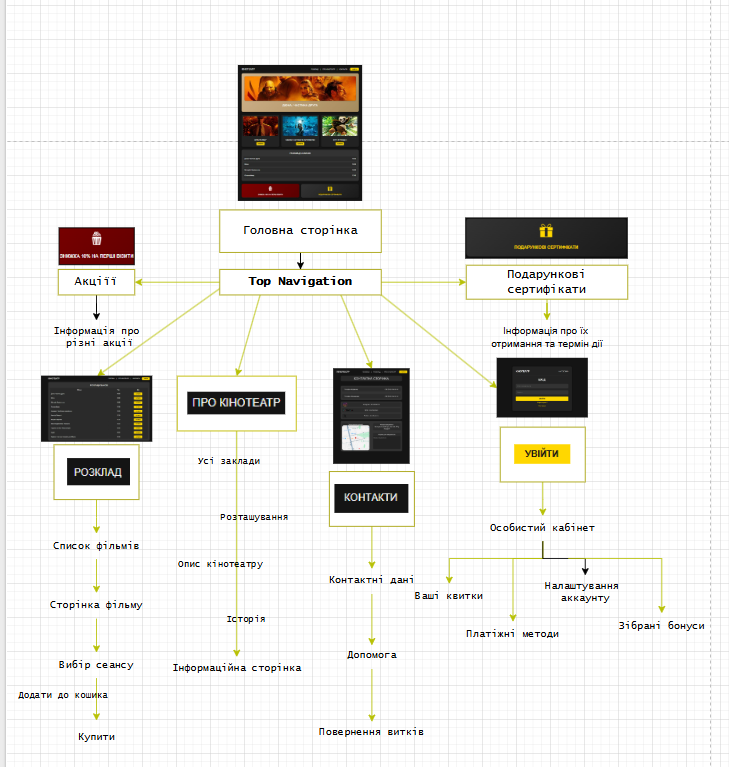
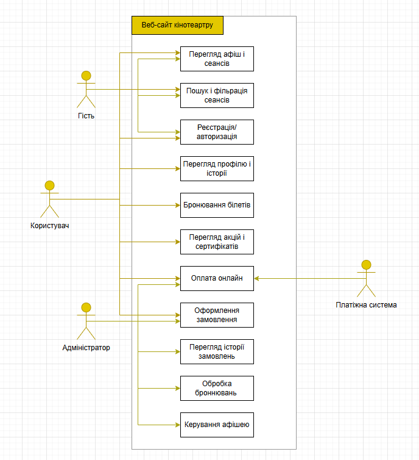

# Технічне завдання (ТЗ)
**Проект:** Вебсайт кінотеатру CinemaVerse.  
**Мета проекту:** Розробити сайт для перегляду інформації про фільми, кінотеатр, а також бронювання і продажу квитків з підтримкою для мобільних пристроїв.  
**Підхід:** Agile (Scrum). 

---

## Короткий опис продукту
Вебсайт CinemaVerse створений для зручного та швидкого доступу до інформації про фільми, розклад сеансів і можливість купівлі чи бронювання квитків онлайн.  
Платформа дозволяє користувачам переглядати афішу, деталі про фільми, акції та прем’єри, а також керувати своїми бронюваннями в особистому кабінеті.  
Головна мета — зробити процес відвідування кінотеатру простим, сучасним, безпечним, та забезпечити доступність сервісу з будь-якого пристрою.
## 1. Найменування й область застосування
**Найменування:** 
Програмний продукт «CinemaVerse» — вебсистема для перегляду інформації про фільми, прем’єри фільмів у прокаті та бронювання квитків до кінотеатру онлайн.  
**Область застосування:** 
Використовується в кінотеатрах.

---

## 2. Підстава для розробки
Розробка проводиться в межах дисципліни «Основи програмної інженерії»  
Студентами спеціальності ІПЗ (Інженерія програмного забезпечення).  

**Документ створено відповідно до:** 
1. ISO/IEC 25010:2011 — *Systems and software quality requirements and evaluation*  
2. Agile Manifesto  
3. Scrum Guide 2020

---

## 3. Призначення розробки

### **Функціональне призначення:**  
Система забезпечує:
- Перегляд розкладу фільмів  
- Купівлю/бронювання квитків онлайн  
- Створення і керування особистим кабінетом  
- Доступ до акцій та новин  

### **Експлуатаційне призначення:**  
Вебдодаток із доступом через браузер (Google Chrome).  
Використовується зі смартфона, ПК або планшета.

---

## 4. Технічні вимоги

### 4.1 Вимоги до складу програмного продукту
Система складається з таких модулів:
- Модуль аутентифікації  
- Модуль авторизації  
- Модуль каталогу фільмів (фільтрація, рейтинг)  
- Модуль розкладу сеансів (час, зал, місце)  
- Модуль бронювання місць  
- Модуль оплати квитків (платіжна система, онлайн-оплата)  
- Модуль генерації квитків  

---

### 4.2 Вимоги до функціональних характеристик

| № | Функція | Опис |
|:-:|:--|:--|
| 1 | Огляд афіші | Список фільмів, профіль фільму (опис, постер, розклад показу, жанр) |
| 2 | Особистий кабінет | Реєстрація, авторизація, історія покупок, управління квитками |
| 3 | Перегляд сеансів | Перегляд дати, залу, місць загальних і вільних |
| 4 | Каталог | Пошук, фільтрація |
| 5 | Бронювання місць | Вибір місця у залі |
| 6 | Оплата квитка | Вибір місця і способу оплати (онлайн, готівка, купон) |
| 7 | Генерація квитка | Створення PDF-квитка з унікальним QR-кодом |
| 8 | Сповіщення | Email/SMS-сповіщення (акції, сеанс, вихід фільму тощо) |
| 9 | Відгуки та рейтинг | IMDB-рейтинг, локальний рейтинг, відгуки від зареєстрованих користувачів |

---

### 4.3 Вимоги до надійності
- Обробка помилок клієнтської та серверної частини  
- Оплата повинна бути підтверджена через додаток банку  

---

### 4.4 Умови експлуатації
- **ОС:** будь-яка, що підтримує сучасний браузер  
- **Браузери:** Chrome, Firefox, Edge, Safari, Opera GX  
- **Інтернет:** рекомендовано ≥ 1.5 Mbps  

---

### 4.5 Вимоги до технічних засобів

| Компонент | Мінімум | Рекомендовано |
|:--|:--|:--|
| Процесор | 2 ядра | 4 ядра |
| ОЗП (RAM) | 2 GB (для користування), 8 GB (для розробки) | 4 GB (для користування) |
| Місце на диску | 20 GB (для розробки) | 30 GB |

---

### 4.6 Мови та середовище розробки
- **Frontend:** React, React Router, Vite, TailwindCSS, CSS  
- **Backend:** Node.js  
- **База даних:** SQLite  
- **Репозиторій:** GitHub  

---

## 5. Техніко-економічні показники

| Показник | Опис |
|:--|:--|
| Собівартість | Симуляція за допомогою ChatGPT. Навчальний, але реалістичний проект — ~1000 USD |
| Оцінка часу | Команда з 4 студентів, 8–10 тижнів |

---

## 6. Стадії та етапи розробки (Agile Scrum)
**Спринти тривалістю 2 тижні**

| № спринту | Основні завдання |
|:--|:--|
| 1 | Аналіз вимог, створення макету, сторінка афіші, компонент фільму, моб/десктоп-версії |
| 2 | Сторінка сеансу, креслення залу, логіка бронювання, база даних |
| 3 | Інтеграція оплати, генерація квитка, особистий кабінет, тестовий платіжний шлюз |
| 4 | Полірування UI, документація, інструкції з розгортання |

---

## 7. Порядок контролю та приймання

### **Види тестування:**
- Unit-тести (Jest)  
- Integration-тести (Postman)  
- UI-тести (Playwright)  
- Користувацьке тестування через Google Forms з фідбеком  

### **ПЗ вважається прийнятим, якщо:**
- проходить 100% тестів  
- транзакції зберігаються у БД, квиток має унікальний QR-код  
- інтерфейс коректно відображається на мобільних і десктопних екранах (360/768/1280 px)  
- усі критичні баги (*blocker/major*) виправлені  

---

## 8. Додатки

- **Логічна структура сайту**  

- **Use case Діаграма**  

